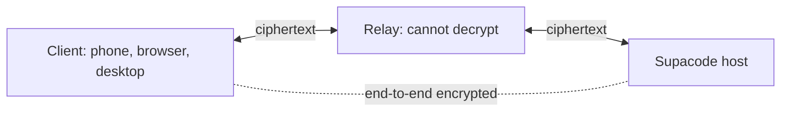

# Supacode relay

An end-to-end encrypted relay for [Supacode](https://github.com/supabitapp/supacode-next). It connects clients to hosts that have no open ports, and it only ever sees ciphertext.



## End-to-end encrypted

Supacode encrypts traffic inside the client and the host, so the relay forwards bytes it can neither read nor forge:

- Each connection agrees on fresh keys with X25519. The host signs the exchange with its Ed25519 identity key, and the client checks it against the key in its pairing link, so the relay cannot pose as the host.
- Every frame is sealed with ChaCha20-Poly1305 and numbered. A modified, replayed, or reordered frame is rejected.
- The relay still sees connection metadata: IP addresses, the host's endpoint ID, timing, and byte counts.

The handshake and cipher live in Supacode's [`packages/shared/src/relay/protocol.ts`](https://github.com/supabitapp/supacode-next/blob/main/packages/shared/src/relay/protocol.ts).

## Use

Supacode uses the public relay at `wss://relay.supacode.sh`. To use your own, set **Settings → Connections → Public relay → Relay server** on the host before creating pairing links.

## Run

With Go 1.25 or later, `make run` listens on `127.0.0.1:8080`. With Docker:

```sh
docker build -t supacode-relay .
docker run -p 8080:8080 supacode-relay
```

## Deploy

The relay does not terminate TLS, so put it behind a proxy that serves `wss://`. Settings are `RELAY_*` environment variables, listed in [configuration](docs/configuration.md).

Run one relay behind the TLS proxy. Hosts register and clients connect to that same instance. See [deployment](docs/deployment.md) for the production service and cutover.

## Docs

- [Protocol](docs/protocol.md)
- [Configuration](docs/configuration.md)
- [Diagnostics](docs/diagnostics.md)
- [Deployment](docs/deployment.md)
- [Performance measurements](docs/multi-node.md#live-transport-investigation)
- [Development](docs/development.md)
- [Fuzz and memory experiments](docs/fuzz-testing.md)

## License

GNU Affero General Public License v3.0 only ([AGPL-3.0-only](LICENSE)). The original MIT copyright and permission notice is preserved in [NOTICE](NOTICE).
