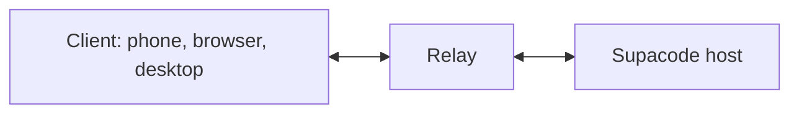
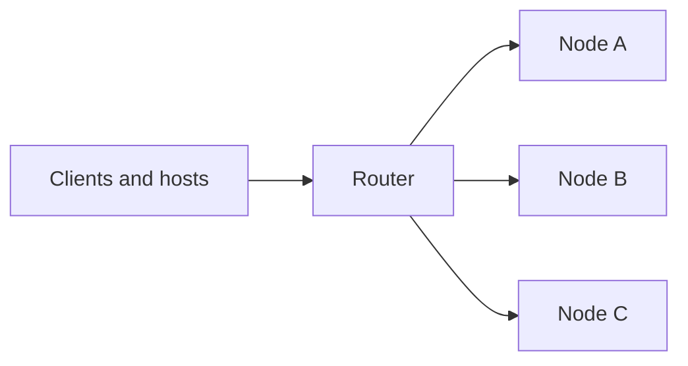

# Supacode relay

Connects Supacode clients to hosts that have no open ports. Both sides dial out to the relay, which pairs them and forwards their end-to-end encrypted traffic without reading it.



## Use

Supacode uses the public relay at `wss://relay.supacode.sh`. To use your own, set **Settings → Connections → Public relay → Relay server** on the host before creating pairing links.

## Run

With Go 1.25 or later, `make run` listens on `127.0.0.1:8080`. With Docker:

```sh
docker build -t supacode-relay .
docker run -p 8080:8080 supacode-relay
```

## Deploy

The relay does not terminate TLS, so put it behind a proxy that serves `wss://`. Settings are `RELAY_*` environment variables, listed in [configuration](docs/configuration.md).

To scale out, run a router in front of several nodes. See [multi-node relay](docs/multi-node.md).



## Docs

- [Protocol](docs/protocol.md)
- [Configuration](docs/configuration.md)
- [Diagnostics](docs/diagnostics.md)
- [Multi-node relay](docs/multi-node.md)
- [Development](docs/development.md)

## License

[MIT](LICENSE)
